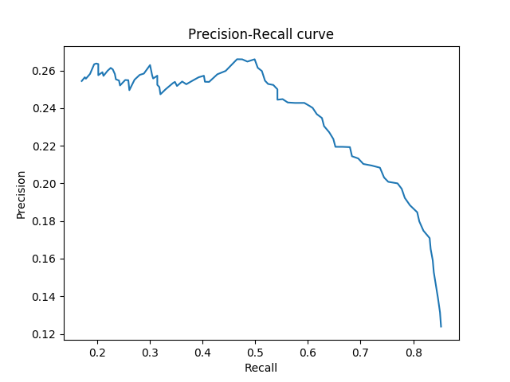

# Mini Project #1: Where are the Genes

Implement a gene-finding algorithm that examines open reading frames and finds subsequences that span from the start codon to the stop codon. Use the full genome of the Mycoplasma genitalium (NCBI ID is [NC_000908](https://www.ncbi.nlm.nih.gov/nuccore/NC_000908)) to find gene candidates. Notice that for this organism the stop codons are only TAA and TAG. Filter out the genes that are too short and contain only, say, L codons, and compare your candidate genes to the genes that are reported in the annotated genome. For comparison, computer recall and precision, and report on the dependence of these two accuracy scores on the length L of the open reading frames. Express the length of L in codons. Answer the questions below, include a figure with a precision/recall curve, and summarize your findings. 

## Questions

**What is the size of Mycoplasma genitalium genome?**

From the NCBI database: 580076 bp

**How many genes does it include?**

From the NCBI database: 563

**What is the length of the smallest and the longest gene (in codons)? What is the median length of the gene (in codons)?**

|                 | Length [codons] |
|-----------------|---------------- |
|Shortest length  | 35              |
|Longest length   | 1806            |
|Median length    | 286             |

**What is the recall/precision of your gene finding procedure at L=50 and L=125 codons?**

| Length [codons]   | Precision | Recall |
|-------------------|-----------|--------|
| 50                | 0.08      | 0.50   |
| 125               | 0.12      | 0.43   |

